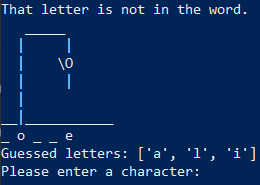

# Hangman   2024 Feb

This project was created on Opiframe's Opikoodia programming course. We had studied Python for two weeks
and this project aims to showcase the skills I have learned at that point. I had done the same project earlier on
C so the process was quite familiar, but there were also considerable differences
due to inherent differences in the languages.

The game Hangman is essentially a word guessing game where the player is given the length of the word and
a number of guesses (in this case 6 wrong guesses) to try and guess letters that are in the word,
and eventually guess the whole word.

The biggest thing that was different about this project in Python compared to C, was the
existence of Python Membership Operators and the amount of effort that they saved compared to C,
while checking letters against words with if-statements. I feel that my understanding of functions
and the instinct where to use them improved from before.

The program uses an sqlite database to access a database of words to guess.

### **EDIT 2026**

Looking at my code nearly two years later, I felt the natural urge to delete the whole project, but since at the moment it is the single larger Python program I can showcase, I decided to keep it. I also did not want to start editing the whole program to a greater extent at this point.

A few notes on the code: 
- I felt there was some rationale behind how I split code into functions. The code should have been split even more, and some functions probably do too much, but some of it was adequate.
- The way I used the database is almost an abuse considering what is possible with SQlite, but it kind of served its purpose, saving words.
- I used input functions that call themselves, which is not apparently a very good idea, but back then I must have thought myself to be pretty smart. Loops would do the same thing.
- The commenting. Quite horrendous and suffocating, there is so much of it. The commenting makes the program hard to read. But I must say that this habit of overly commenting was at first a good way to try and write out for myself what is happening in the program. I should have just kept it in a private version. But this was my understanding of commenting at first, writing everything explicitly out.
